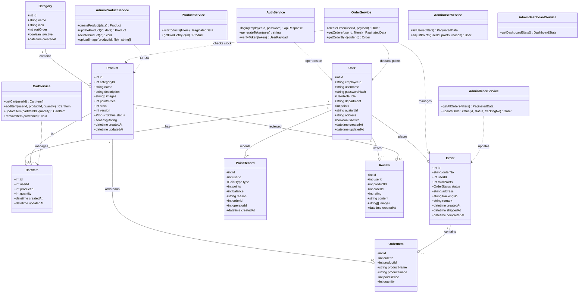
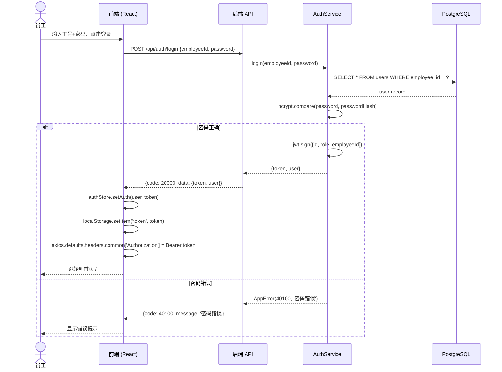
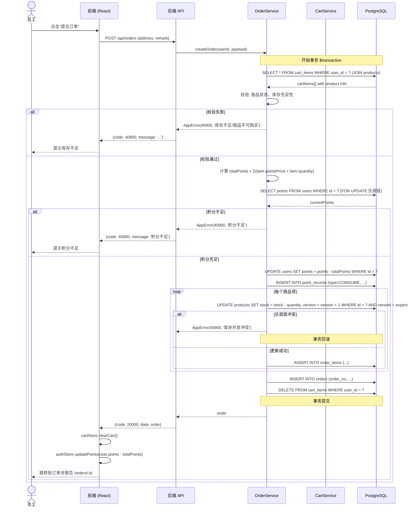
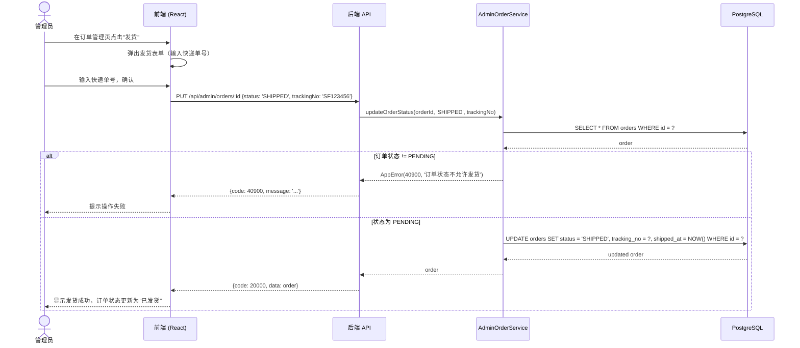

# 企业内部商城 - 系统架构设计文档

> 架构师：高见远（Gao）  
> 日期：2026-06-26  
> 版本：v1.0

---

## 目录

- [Part A: 系统设计](#part-a-系统设计)
  - [1. 实现方案](#1-实现方案)
  - [2. 文件列表](#2-文件列表)
  - [3. 数据结构与接口](#3-数据结构与接口)
  - [4. 程序调用流程](#4-程序调用流程)
  - [5. 待明确事项](#5-待明确事项)
- [Part B: 任务分解](#part-b-任务分解)
  - [6. 依赖包列表](#6-依赖包列表)
  - [7. 任务列表](#7-任务列表)
  - [8. 共享知识](#8-共享知识)
  - [9. 任务依赖图](#9-任务依赖图)

---

# Part A: 系统设计

## 1. 实现方案

### 1.1 核心技术挑战

| 挑战 | 分析 | 解决方案 |
|------|------|---------|
| 积分扣减与库存扣减原子性 | 下单需同时扣减积分和库存，若部分失败需回滚 | 使用数据库事务（Prisma `$transaction`）包裹扣减逻辑，配合乐观锁（版本字段） |
| 购物车实时计算 | 多商品增删改需实时更新总积分 | 前端 Zustand store 计算派生状态，后端仅在 checkout 时校验 |
| 图片上传与管理 | 商品多图上传、存储、访问 | 后端 multer 中间件 + 本地文件存储（开发阶段），Express static 静态服务 |
| JWT 认证与角色鉴权 | 员工/管理员双角色，不同页面权限 | 路由守卫 + 后端中间件双重鉴权，role 字段区分 |
| 并发下单库存冲突 | 内部系统并发量可控但需防超卖 | 乐观锁：Product 增加 version 字段，下单时 WHERE version = expected |

### 1.2 前端架构方案

**SPA 单页应用 + 嵌套路由**

```
架构模式：基于 React Router 的 SPA
状态管理：Zustand（轻量、支持 slice 拆分）
UI 框架：MUI v5 + Tailwind CSS 辅助样式
构建工具：Vite
```

**前端分层结构：**

```
src/
  api/          — API 调用层（axios 封装，统一错误处理）
  stores/       — Zustand 状态管理（auth, cart, product, order, admin）
  components/   — 通用 UI 组件（Header, Footer, Guard 等）
  pages/        — 页面级组件（按路由组织）
    employee/   — 员工端页面
    admin/      — 管理员端页面
  hooks/        — 自定义 hooks（useAuth, useCart, usePagination）
  types/        — TypeScript 类型定义
  utils/        — 工具函数（formatPoints, validate 等）
```

**路由结构：**

```typescript
// 员工端路由
<Routes>
  <Route element={<EmployeeLayout />}>
    <Route path="/" element={<ProductList />} />
    <Route path="/product/:id" element={<ProductDetail />} />
    <Route path="/cart" element={<Cart />} />
    <Route path="/checkout" element={<Checkout />} />
    <Route path="/orders" element={<OrderList />} />
    <Route path="/orders/:id" element={<OrderDetail />} />
    <Route path="/profile" element={<Profile />} />
  </Route>
  <Route path="/login" element={<Login />} />
</Routes>

// 管理员端路由
<Routes>
  <Route element={<AdminLayout />}>
    <Route path="/admin" element={<Dashboard />} />
    <Route path="/admin/products" element={<AdminProductList />} />
    <Route path="/admin/products/new" element={<AdminProductForm />} />
    <Route path="/admin/products/:id/edit" element={<AdminProductForm />} />
    <Route path="/admin/orders" element={<AdminOrderList />} />
    <Route path="/admin/users" element={<AdminUserList />} />
    <Route path="/admin/categories" element={<AdminCategoryList />} />
  </Route>
</Routes>
```

**状态管理方案（Zustand slices）：**

| Store | 职责 | 关键 state |
|-------|------|-----------|
| authStore | 用户认证、角色、token | user, token, isAuthenticated, role |
| cartStore | 购物车增删改查 | items[], totalPoints, addItem, removeItem, updateQuantity |
| productStore | 商品列表、筛选、搜索 | products[], filters, pagination, searchQuery |
| orderStore | 订单列表、详情 | orders[], currentOrder, orderFilters |
| adminStore | 管理员操作状态 | dashboardStats, editingProduct, loadingStates |

### 1.3 后端架构方案

**经典三层架构 + 中间件管道**

```
架构模式：Controller → Service → Repository（Prisma ORM）
认证：JWT（jsonwebtoken）
文件上传：multer
校验：express-validator
```

**后端分层结构：**

```
server/
  src/
    config/      — 配置（数据库、JWT密钥、端口等）
    middleware/   — 中间件（auth, roleGuard, errorHandler, upload）
    routes/      — 路由定义（按模块分组）
    controllers/ — 接收请求、参数校验、调用 service、返回响应
    services/    — 业务逻辑（事务、校验、组合操作）
    prisma/      — Prisma schema & migrations
  uploads/       — 上传文件目录
```

**中间件管道：**

```
Request → cors → helmet → express.json → authMiddleware(可选) → roleGuard(可选) → controller → service → response
         ↓
       errorHandler（全局异常捕获）
```

### 1.4 前后端通信方案

**RESTful API 设计要点：**

| 原则 | 实现 |
|------|------|
| 统一响应格式 | `{ code: number, data: T, message: string }` |
| 错误码体系 | 20000=成功, 40001=参数错误, 40100=未认证, 40300=无权限, 40400=资源不存在, 40900=冲突(库存不足), 50000=服务异常 |
| 分页参数 | `?page=1&pageSize=20`，响应含 `total` |
| JWT 传递 | Authorization: Bearer <token> |
| 文件上传 | multipart/form-data，单文件最大 5MB |

**API Endpoint 总览：**

```
认证：
  POST   /api/auth/login          — 登录
  POST   /api/auth/logout         — 登出（可选，前端清除 token 即可）

商品：
  GET    /api/products             — 商品列表（支持 ?category=&search=&page=&pageSize=）
  GET    /api/products/:id         — 商品详情

购物车：
  GET    /api/cart                 — 获取购物车
  POST   /api/cart                 — 添加商品到购物车
  PUT    /api/cart/:id             — 更新购物车项数量
  DELETE /api/cart/:id             — 删除购物车项

订单：
  POST   /api/orders               — 创建订单（checkout）
  GET    /api/orders               — 我的订单列表（?status=&page=&pageSize=）
  GET    /api/orders/:id           — 订单详情

用户：
  GET    /api/users/profile        — 获取当前用户信息
  PUT    /api/users/profile        — 更新用户信息（地址等）
  GET    /api/users/points         — 积分记录

管理员-商品：
  POST   /api/admin/products       — 创建商品
  PUT    /api/admin/products/:id   — 更新商品
  DELETE /api/admin/products/:id   — 删除商品
  POST   /api/admin/products/:id/images — 上传商品图片

管理员-分类：
  GET    /api/admin/categories     — 分类列表
  POST   /api/admin/categories     — 创建分类
  PUT    /api/admin/categories/:id — 更新分类
  DELETE /api/admin/categories/:id — 删除分类

管理员-订单：
  GET    /api/admin/orders         — 所有订单（支持筛选）
  PUT    /api/admin/orders/:id     — 更新订单状态（发货/完成）

管理员-用户：
  GET    /api/admin/users          — 用户列表
  PUT    /api/admin/users/:id/points — 批量发放/调整积分

管理员-看板：
  GET    /api/admin/dashboard      — 数据看板统计
```

---

## 2. 文件列表

### 前端文件（client/）

```
client/
├── package.json
├── vite.config.ts
├── tailwind.config.ts
├── tsconfig.json
├── tsconfig.node.json
├── index.html
├── public/
│   └── favicon.ico
└── src/
    ├── main.tsx                          — 应用入口
    ├── App.tsx                           — 路由配置 + Provider
    ├── vite-env.d.ts
    │
    ├── types/
    │   ├── index.ts                      — 类型统一导出
    │   ├── user.ts                       — User, AuthState, PointRecord 类型
    │   ├── product.ts                    — Product, Category, CartItem 类型
    │   ├── order.ts                      — Order, OrderItem, OrderStatus 类型
    │   └── api.ts                        — ApiResponse, PaginatedResponse 类型
    │
    ├── api/
    │   ├── client.ts                     — axios 实例（baseURL, interceptor）
    │   ├── auth.ts                       — login, logout API
    │   ├── product.ts                    — 商品相关 API
    │   ├── cart.ts                       — 购物车相关 API
    │   ├── order.ts                      — 订单相关 API
    │   ├── user.ts                       — 用户/积分 API
    │   └── admin.ts                      — 管理员 API（商品/分类/订单/用户/看板）
    │
    ├── stores/
    │   ├── authStore.ts                  — 认证状态 + token 管理
    │   ├── cartStore.ts                  — 购物车状态 + totalPoints 计算
    │   ├── productStore.ts              — 商品列表/筛选/搜索
    │   ├── orderStore.ts                — 订单列表/详情
    │   └── adminStore.ts                — 管理员操作状态
    │
    ├── hooks/
    │   ├── useAuth.ts                    — 认证相关 hook
    │   ├── useCart.ts                    — 购物车操作 hook
    │   ├── usePagination.ts             — 分页 hook
    │   └── useNotification.ts           — 通知/toast hook
    │
    ├── components/
    │   ├── Layout/
    │   │   ├── EmployeeLayout.tsx        — 员工端布局（Header + Footer）
    │   │   ├── AdminLayout.tsx           — 管理员端布局（Sidebar + Header）
    │   │   ├── Header.tsx                — 顶部导航（含用户信息/积分）
    │   │   ├── Footer.tsx
    │   │   └── Sidebar.tsx               — 管理员侧边栏
    │   ├── AuthGuard.tsx                 — 路由认证守卫
    │   ├── RoleGuard.tsx                 — 角色权限守卫
    │   ├── ProductCard.tsx               — 商品卡片组件
    │   ├── CartItemCard.tsx              — 购物车项卡片
    │   ├── OrderStatusTag.tsx            — 订单状态标签
    │   ├── ImageCarousel.tsx             — 图片轮播组件
    │   ├── Pagination.tsx                — 分页组件
    │   ├── SearchBar.tsx                 — 搜索栏组件
    │   ├── CategoryFilter.tsx            — 分类筛选组件
    │   ├── PointBadge.tsx                — 积分徽章
    │   └── LoadingSpinner.tsx            — 加载状态
    │   └── Notification.tsx              — 全局通知/Toast
    │
    ├── pages/
    │   ├── employee/
    │   │   ├── Login.tsx                 — 登录页
    │   │   ├── ProductList.tsx           — 商品列表页
    │   │   ├── ProductDetail.tsx         — 商品详情页
    │   │   ├── Cart.tsx                  — 购物车页
    │   │   ├── Checkout.tsx              — 结算确认页
    │   │   ├── OrderList.tsx             — 我的订单列表
    │   │   ├── OrderDetail.tsx           — 订单详情页
    │   │   └── Profile.tsx              — 个人信息页
    │   ├── admin/
    │   │   ├── Dashboard.tsx             — 数据看板
    │   │   ├── AdminProductList.tsx      — 管理员商品列表
    │   │   ├── AdminProductForm.tsx      — 商品创建/编辑表单
    │   │   ├── AdminOrderList.tsx        — 管理员订单管理
    │   │   ├── AdminUserList.tsx         — 用户管理 + 积分发放
    │   │   ├── AdminCategoryList.tsx     — 分类管理
    │   │
    ├── utils/
    │   ├── format.ts                     — 格式化函数（积分、日期、订单号）
    │   ├── validate.ts                   — 校验函数
    │   ├── constants.ts                  — 常量定义（API前缀、订单状态枚举等）
    │
    └── styles/
        ├── globals.css                   — 全局样式 + Tailwind 指令
```

### 后端文件（server/）

```
server/
├── package.json
├── tsconfig.json
├── .env.example                        — 环境变量示例
├── nodemon.json                        — 开发热重载配置
├── uploads/                            — 图片上传目录
│   └── products/                       — 商品图片
├── prisma/
│   ├── schema.prisma                   — 数据模型定义
│   └── migrations/                     — 数据库迁移文件（由 prisma generate 生成）
├── src/
│   ├── index.ts                        — 服务器入口（Express app 创建 + 启动）
│   ├── config/
│   │   ├── index.ts                    — 配置统一导出
│   │   ├── database.ts                 — 数据库连接配置
│   │   ├── jwt.ts                      — JWT 配置（密钥、过期时间）
│   │   └── server.ts                   — 服务器配置（端口、CORS）
│   │
│   ├── middleware/
│   │   ├── auth.ts                     — JWT 认证中间件
│   │   ├── roleGuard.ts                — 角色权限中间件
│   │   ├── errorHandler.ts             — 全局错误处理
│   │   ├── upload.ts                   — multer 文件上传中间件
│   │   └── validate.ts                 — express-validator 校验中间件工厂
│   │
│   ├── routes/
│   │   ├── index.ts                    — 路由统一注册
│   │   ├── authRoutes.ts               — 认证路由
│   │   ├── productRoutes.ts            — 商品路由（公开）
│   │   ├── cartRoutes.ts               — 购物车路由
│   │   ├── orderRoutes.ts              — 订单路由
│   │   ├── userRoutes.ts               — 用户路由
│   │   └── adminRoutes.ts              — 管理员路由（商品/分类/订单/用户/看板）
│   │
│   ├── controllers/
│   │   ├── authController.ts           — 登录/登出
│   │   ├── productController.ts        — 商品列表/详情
│   │   ├── cartController.ts           — 购物车 CRUD
│   │   ├── orderController.ts          — 订单创建/查询
│   │   ├── userController.ts           — 用户信息/积分
│   │   ├── adminProductController.ts   — 管理员商品管理
│   │   ├── adminCategoryController.ts  — 管理员分类管理
│   │   ├── adminOrderController.ts     — 管理员订单管理
│   │   ├── adminUserController.ts      — 管理员用户管理
│   │   ├── adminDashboardController.ts — 数据看板
│   │
│   ├── services/
│   │   ├── authService.ts              — 认证逻辑（密码校验、JWT生成）
│   │   ├── productService.ts           — 商品查询逻辑
│   │   ├── cartService.ts              — 购物车逻辑
│   │   ├── orderService.ts             — 下单逻辑（事务：积分+库存扣减）
│   │   ├── userService.ts              — 用户/积分逻辑
│   │   ├── adminProductService.ts      — 商品 CRUD + 图片
│   │   ├── adminCategoryService.ts     — 分类 CRUD
│   │   ├── adminOrderService.ts        — 订单状态更新
│   │   ├── adminUserService.ts         — 积分发放/调整
│   │   ├── adminDashboardService.ts    — 统计数据聚合
│   │
│   ├── utils/
│   │   ├── response.ts                 — 统一响应工具（success, error, paginate）
│   │   ├── errors.ts                   — 自定义错误类（AppError, NotFoundError 等）
│   │   ├── hash.ts                     — 密码哈希（bcrypt）
│   │   ├── orderNo.ts                  — 订单号生成
│   │
│   ├── types/
│   │   ├── index.ts                    — Express Request 扩展（user 字段）
│   │   └── enums.ts                    — 枚举定义（UserRole, OrderStatus 等）
```

**总计：约 70+ 个源文件**

---

## 3. 数据结构与接口

### 3.1 Prisma Schema（后端数据模型）

```prisma
generator client {
  provider = "prisma-client-js"
}

datasource db {
  provider = "postgresql"
  url      = env("DATABASE_URL")
}

enum UserRole {
  EMPLOYEE
  ADMIN
}

enum OrderStatus {
  PENDING
  SHIPPED
  COMPLETED
  CANCELLED
}

enum PointType {
  GRANT
  CONSUME
  REFUND
  ADJUST
}

enum ProductStatus {
  ACTIVE
  INACTIVE
}

model User {
  id            Int       @id @default(autoincrement())
  employeeId    String    @unique @map("employee_id")
  username      String    @unique
  passwordHash  String    @map("password_hash")
  role          UserRole  @default(EMPLOYEE)
  department    String?
  points        Int       @default(0)
  avatarUrl     String?   @map("avatar_url")
  address       String?   // 员工自填收货地址
  isActive      Boolean   @default(true) @map("is_active")
  createdAt     DateTime  @default(now()) @map("created_at")
  updatedAt     DateTime  @updatedAt @map("updated_at")

  cartItems     CartItem[]
  orders        Order[]
  pointRecords  PointRecord[]
  reviews       Review[]

  @@map("users")
}

model Category {
  id        Int      @id @default(autoincrement())
  name      String   @unique
  icon      String?
  sortOrder Int      @default(0) @map("sort_order")
  isActive  Boolean  @default(true) @map("is_active")
  createdAt DateTime @default(now()) @map("created_at")

  products  Product[]

  @@map("categories")
}

model Product {
  id           Int           @id @default(autoincrement())
  categoryId   Int           @map("category_id")
  name         String
  description  String?
  images       String[]      // JSON array of image URLs
  pointsPrice  Int           @map("points_price")
  stock        Int           @default(0)
  version      Int           @default(0) // 乐观锁版本号
  status       ProductStatus @default(ACTIVE)
  avgRating    Float         @default(0) @map("avg_rating")
  createdAt    DateTime      @default(now()) @map("created_at")
  updatedAt    DateTime      @updatedAt @map("updated_at")

  category     Category      @relation(fields: [categoryId], references: [id])
  cartItems    CartItem[]
  orderItems   OrderItem[]
  reviews      Review[]

  @@map("products")
}

model CartItem {
  id        Int      @id @default(autoincrement())
  userId    Int      @map("user_id")
  productId Int      @map("product_id")
  quantity  Int      @default(1)
  createdAt DateTime @default(now()) @map("created_at")
  updatedAt DateTime @updatedAt @map("updated_at")

  user      User     @relation(fields: [userId], references: [id])
  product   Product  @relation(fields: [productId], references: [id])

  @@unique([userId, productId])
  @@map("cart_items")
}

model Order {
  id           Int         @id @default(autoincrement())
  orderNo      String      @unique @map("order_no")
  userId       Int         @map("user_id")
  totalPoints  Int         @map("total_points")
  status       OrderStatus @default(PENDING)
  address      String?
  trackingNo   String?     @map("tracking_no")
  remark       String?
  createdAt    DateTime    @default(now()) @map("created_at")
  shippedAt    DateTime?   @map("shipped_at")
  completedAt  DateTime?   @map("completed_at")

  user         User        @relation(fields: [userId], references: [id])
  orderItems   OrderItem[]

  @@map("orders")
}

model OrderItem {
  id            Int     @id @default(autoincrement())
  orderId       Int     @map("order_id")
  productId     Int     @map("product_id")
  productName   String  @map("product_name")
  productImage  String  @map("product_image")
  pointsPrice   Int     @map("points_price")
  quantity      Int

  order         Order   @relation(fields: [orderId], references: [id])

  @@map("order_items")
}

model PointRecord {
  id         Int       @id @default(autoincrement())
  userId     Int       @map("user_id")
  type       PointType
  points     Int
  balance    Int       // 操作后余额
  reason     String?
  orderId    Int?      @map("order_id")
  operatorId Int?      @map("operator_id")
  createdAt  DateTime  @default(now()) @map("created_at")

  user       User      @relation(fields: [userId], references: [id])
  operator   User?     @relation("OperatedPoints", fields: [operatorId], references: [id])

  @@map("point_records")
}

model Review {
  id        Int      @id @default(autoincrement())
  userId    Int      @map("user_id")
  productId Int      @map("product_id")
  orderId   Int      @map("order_id")
  rating    Int      // 1-5
  content   String?
  images    String[]
  createdAt DateTime @default(now()) @map("created_at")

  user      User     @relation(fields: [userId], references: [id])
  product   Product  @relation(fields: [productId], references: [id])
  order     Order    @relation(fields: [orderId], references: [id]) // P1: 暂不关联，MVP 跳过

  @@map("reviews")
}
```

### 3.2 前端 TypeScript 类型定义

```typescript
// types/api.ts
interface ApiResponse<T> {
  code: number;
  data: T;
  message: string;
}

interface PaginatedData<T> {
  items: T[];
  total: number;
  page: number;
  pageSize: number;
}

// types/user.ts
interface User {
  id: number;
  employeeId: string;
  username: string;
  role: 'EMPLOYEE' | 'ADMIN';
  department: string | null;
  points: number;
  avatarUrl: string | null;
  address: string | null;
  isActive: boolean;
  createdAt: string;
}

interface PointRecord {
  id: number;
  userId: number;
  type: 'GRANT' | 'CONSUME' | 'REFUND' | 'ADJUST';
  points: number;
  balance: number;
  reason: string | null;
  orderId: number | null;
  createdAt: string;
}

// types/product.ts
interface Product {
  id: number;
  categoryId: number;
  name: string;
  description: string | null;
  images: string[];
  pointsPrice: number;
  stock: number;
  status: 'ACTIVE' | 'INACTIVE';
  avgRating: number;
  createdAt: string;
  updatedAt: string;
  category?: Category;
}

interface Category {
  id: number;
  name: string;
  icon: string | null;
  sortOrder: number;
  isActive: boolean;
}

interface CartItem {
  id: number;
  productId: number;
  quantity: number;
  product?: Product;
}

// types/order.ts
type OrderStatus = 'PENDING' | 'SHIPPED' | 'COMPLETED' | 'CANCELLED';

interface Order {
  id: number;
  orderNo: string;
  userId: number;
  totalPoints: number;
  status: OrderStatus;
  address: string | null;
  trackingNo: string | null;
  remark: string | null;
  createdAt: string;
  shippedAt: string | null;
  completedAt: string | null;
  orderItems: OrderItem[];
}

interface OrderItem {
  id: number;
  orderId: number;
  productId: number;
  productName: string;
  productImage: string;
  pointsPrice: number;
  quantity: number;
}

interface CreateOrderPayload {
  address: string;
  remark?: string;
}

// types/admin.ts
interface DashboardStats {
  totalProducts: number;
  totalOrders: number;
  totalUsers: number;
  totalPointsConsumed: number;
  recentOrders: Order[];
  topProducts: Product[];
}
```

### 3.3 类图（Mermaid）



---

## 4. 程序调用流程

### 4.1 登录流程时序图



### 4.2 下单流程时序图（含积分扣减 + 库存扣减）



### 4.3 管理员发货流程时序图



---

## 5. 待明确事项

| # | 事项 | 当前假设 | 风险 | 建议 |
|---|------|---------|------|------|
| OQ-01 | 积分发放方式 | 管理员手工批量发放 | 大批量发放时性能问题 | MVP 先做单用户发放，批量发放作为 P1 扩展 |
| OQ-02 | 收货地址 | 员工自填地址 | 地址格式不统一 | Checkout 页面做地址校验（长度+基本格式） |
| OQ-03 | 账号来源 | 商城自建账号体系 | 初始密码安全性 | 默认密码 = 工号后6位，首次登录强制修改（P1） |
| OQ-04 | 库存并发 | 乐观锁（version字段） | 极端并发下失败率高 | 内部系统并发可控，乐观锁足够；若未来并发高可切换悲观锁 |
| OQ-05 | 商品图片存储 | 本地文件系统 + Express static | 生产环境不适用 | MVP 用本地存储，生产部署时迁移到 OSS/CDN |
| OQ-06 | 积分退款机制 | 订单取消时自动退还积分 | 需确保退款事务原子性 | 在取消订单的 service 中使用事务同时回退积分+库存 |
| OQ-07 | 数据隔离 | 单租户部署 | 无跨企业隔离需求 | MVP 不考虑多租户 |
| OQ-08 | 搜索引擎 | PostgreSQL LIKE 查询 | 大数据量性能差 | MVP 用 LIKE，P1 引入全文搜索 |
| OQ-09 | 通知机制 | 无（员工自行查看订单状态） | 用户体验欠佳 | P1 加入站内通知/邮件通知 |
| OQ-10 | 初始数据 | 管理员通过界面创建 | 需要种子数据脚本 | 提供 seed.sql 创建初始管理员账号和基础分类 |

---

# Part B: 任务分解

## 6. 依赖包列表

### 前端依赖（client/package.json）

```
核心框架：
- react@^18.2.0: UI 框架
- react-dom@^18.2.0: React DOM 渲染
- react-router-dom@^6.20.0: 路由管理

状态管理：
- zustand@^4.4.0: 轻量状态管理

UI 组件：
- @mui/material@^5.14.0: Material-UI 组件库
- @mui/icons-material@^5.14.0: MUI 图标
- @emotion/react@^11.11.0: MUI 样式引擎
- @emotion/styled@^11.11.0: MUI 样式引擎

样式：
- tailwindcss@^3.4.0: CSS 工具类框架
- postcss@^8.4.0: CSS 处理
- autoprefixer@^10.4.0: CSS 前缀自动添加

HTTP 通信：
- axios@^1.6.0: HTTP 客户端

工具：
- dayjs@^1.11.0: 日期处理

开发依赖：
- vite@^5.0.0: 构建工具
- @vitejs/plugin-react@^4.2.0: Vite React 插件
- typescript@^5.3.0: TypeScript
- @types/react@^18.2.0: React 类型定义
- @types/react-dom@^18.2.0: React DOM 类型定义
- @types/node@^20.10.0: Node 类型定义
```

### 后端依赖（server/package.json）

```
核心框架：
- express@^4.18.0: Web 框架
- cors@^2.8.5: CORS 中间件
- helmet@^7.1.0: 安全中间件
- morgan@^1.10.0: HTTP 日志中间件

数据库：
- prisma@^5.7.0: Prisma ORM CLI
- @prisma/client@^5.7.0: Prisma 客户端

认证：
- jsonwebtoken@^9.0.0: JWT 生成与验证
- bcryptjs@^2.4.3: 密码哈希

文件上传：
- multer@^1.4.4: 文件上传中间件

校验：
- express-validator@^7.0.0: 请求参数校验

工具：
- dotenv@^16.3.0: 环境变量管理
- uuid@^9.0.0: UUID 生成（订单号可选）

开发依赖：
- typescript@^5.3.0: TypeScript
- ts-node@^10.9.0: TypeScript Node 执行
- nodemon@^3.0.0: 开发热重载
- @types/express@^4.17.0: Express 类型定义
- @types/cors@^2.8.0: CORS 类型定义
- @types/multer@^1.4.0: multer 类型定义
- @types/jsonwebtoken@^9.0.0: JWT 类型定义
- @types/bcryptjs@^2.4.0: bcryptjs 类型定义
- @types/morgan@^1.10.0: morgan 类型定义
- @types/uuid@^9.0.0: uuid 类型定义
```

---

## 7. 任务列表

### T01: 项目基础设施

**说明**: 配置文件 + 入口文件 + 依赖声明，前后端全部放一个任务。这是所有后续任务的基础。

**源文件**:
- `client/package.json`
- `client/vite.config.ts`
- `client/tailwind.config.ts`
- `client/tsconfig.json`
- `client/tsconfig.node.json`
- `client/index.html`
- `client/src/main.tsx`
- `client/src/App.tsx`
- `client/src/vite-env.d.ts`
- `client/src/styles/globals.css`
- `client/public/favicon.ico`
- `server/package.json`
- `server/tsconfig.json`
- `server/.env.example`
- `server/nodemon.json`
- `server/src/index.ts` — Express 入口（app 创建 + 中间件注册 + 启动）
- `server/src/config/index.ts`
- `server/src/config/database.ts`
- `server/src/config/jwt.ts`
- `server/src/config/server.ts`
- `server/src/types/index.ts` — Express Request 扩展
- `server/src/types/enums.ts` — 枚举定义
- `server/src/utils/response.ts` — 统一响应工具
- `server/src/utils/errors.ts` — 自定义错误类
- `server/src/middleware/errorHandler.ts` — 全局错误处理

**依赖**: 无

**优先级**: P0

---

### T02: 数据层 + API 核心

**说明**: Prisma Schema + 数据库迁移 + 所有后端 Service/Controller/Route + 中间件（auth/roleGuard/upload/validate）。实现完整后端 API，工程师可以独立调试 API。

**源文件**:
- `server/prisma/schema.prisma` — 完整数据模型定义
- `server/src/middleware/auth.ts` — JWT 认证中间件
- `server/src/middleware/roleGuard.ts` — 角色权限中间件
- `server/src/middleware/upload.ts` — multer 文件上传
- `server/src/middleware/validate.ts` — 校验中间件工厂
- `server/src/utils/hash.ts` — bcrypt 密码哈希
- `server/src/utils/orderNo.ts` — 订单号生成
- `server/src/routes/index.ts` — 路由统一注册
- `server/src/routes/authRoutes.ts`
- `server/src/routes/productRoutes.ts`
- `server/src/routes/cartRoutes.ts`
- `server/src/routes/orderRoutes.ts`
- `server/src/routes/userRoutes.ts`
- `server/src/routes/adminRoutes.ts`
- `server/src/controllers/authController.ts`
- `server/src/controllers/productController.ts`
- `server/src/controllers/cartController.ts`
- `server/src/controllers/orderController.ts`
- `server/src/controllers/userController.ts`
- `server/src/controllers/adminProductController.ts`
- `server/src/controllers/adminCategoryController.ts`
- `server/src/controllers/adminOrderController.ts`
- `server/src/controllers/adminUserController.ts`
- `server/src/controllers/adminDashboardController.ts`
- `server/src/services/authService.ts`
- `server/src/services/productService.ts`
- `server/src/services/cartService.ts`
- `server/src/services/orderService.ts`
- `server/src/services/userService.ts`
- `server/src/services/adminProductService.ts`
- `server/src/services/adminCategoryService.ts`
- `server/src/services/adminOrderService.ts`
- `server/src/services/adminUserService.ts`
- `server/src/services/adminDashboardService.ts`
- `server/uploads/products/` — 图片上传目录（空目录）

**依赖**: T01

**优先级**: P0

---

### T03: 前端数据层 + 核心页面组件

**说明**: TypeScript 类型定义 + Zustand stores + API 调用层 + Hooks + 员工端核心页面（登录、商品列表、商品详情、购物车、结算、订单列表、订单详情、个人信息）+ 关键业务组件（ProductCard, CartItemCard, ImageCarousel, OrderStatusTag 等）+ 布局组件 + 路由守卫。

**源文件**:
- `client/src/types/index.ts`
- `client/src/types/user.ts`
- `client/src/types/product.ts`
- `client/src/types/order.ts`
- `client/src/types/api.ts`
- `client/src/api/client.ts`
- `client/src/api/auth.ts`
- `client/src/api/product.ts`
- `client/src/api/cart.ts`
- `client/src/api/order.ts`
- `client/src/api/user.ts`
- `client/src/api/admin.ts`
- `client/src/stores/authStore.ts`
- `client/src/stores/cartStore.ts`
- `client/src/stores/productStore.ts`
- `client/src/stores/orderStore.ts`
- `client/src/stores/adminStore.ts`
- `client/src/hooks/useAuth.ts`
- `client/src/hooks/useCart.ts`
- `client/src/hooks/usePagination.ts`
- `client/src/hooks/useNotification.ts`
- `client/src/utils/format.ts`
- `client/src/utils/validate.ts`
- `client/src/utils/constants.ts`
- `client/src/components/Layout/EmployeeLayout.tsx`
- `client/src/components/Layout/AdminLayout.tsx`
- `client/src/components/Layout/Header.tsx`
- `client/src/components/Layout/Footer.tsx`
- `client/src/components/Layout/Sidebar.tsx`
- `client/src/components/AuthGuard.tsx`
- `client/src/components/RoleGuard.tsx`
- `client/src/components/ProductCard.tsx`
- `client/src/components/CartItemCard.tsx`
- `client/src/components/OrderStatusTag.tsx`
- `client/src/components/ImageCarousel.tsx`
- `client/src/components/Pagination.tsx`
- `client/src/components/SearchBar.tsx`
- `client/src/components/CategoryFilter.tsx`
- `client/src/components/PointBadge.tsx`
- `client/src/components/LoadingSpinner.tsx`
- `client/src/components/Notification.tsx`
- `client/src/pages/employee/Login.tsx`
- `client/src/pages/employee/ProductList.tsx`
- `client/src/pages/employee/ProductDetail.tsx`
- `client/src/pages/employee/Cart.tsx`
- `client/src/pages/employee/Checkout.tsx`
- `client/src/pages/employee/OrderList.tsx`
- `client/src/pages/employee/OrderDetail.tsx`
- `client/src/pages/employee/Profile.tsx`

**依赖**: T01

**优先级**: P0

---

### T04: 管理员端页面组件

**说明**: 管理员端所有页面（数据看板、商品管理、分类管理、订单管理、用户管理），包含管理员专用的表格、表单、图片上传等 UI。管理员页面依赖 adminStore 和 admin API，但可与 T03 并行开发（共享 T01 基础设施）。

**源文件**:
- `client/src/pages/admin/Dashboard.tsx`
- `client/src/pages/admin/AdminProductList.tsx`
- `client/src/pages/admin/AdminProductForm.tsx`
- `client/src/pages/admin/AdminOrderList.tsx`
- `client/src/pages/admin/AdminUserList.tsx`
- `client/src/pages/admin/AdminCategoryList.tsx`

**依赖**: T01, T03（共享 adminStore + admin API + AdminLayout + RoleGuard）

**优先级**: P1

---

### T05: 路由集成 + 最终调试

**说明**: 完善路由配置、页面间跳转逻辑、前后端联调、种子数据脚本、最终集成测试。确保所有页面正确渲染、API 通信正常、权限守卫生效。

**源文件**:
- `client/src/App.tsx` — 最终路由配置完善（合并员工端和管理员端路由）
- `server/prisma/seed.ts` — 种子数据脚本（初始管理员 + 基础分类）
- 调整和修复所有文件中的集成问题

**依赖**: T01, T02, T03, T04

**优先级**: P0

---

## 8. 共享知识

### 8.1 代码风格约定

```
- 前端使用 TypeScript strict 模式
- 后端使用 TypeScript strict 模式
- 文件命名：组件用 PascalCase（ProductCard.tsx），其他用 camelCase（authService.ts）
- 目录命名：camelCase
- React 组件：函数式组件 + hooks，禁止 class 组件
- 后端 Service 类：使用 class 组织方法，Controller 使用函数导出
- Prisma model 字段使用 @map 转换 snake_case 数据库列名到 camelCase TypeScript 属性
```

### 8.2 API 响应格式约定

```typescript
// 所有 API 统一响应格式
{
  code: number,     // 业务状态码（非 HTTP 状态码）
  data: T | null,   // 业务数据
  message: string   // 描述信息
}

// 成功响应
{ code: 20000, data: {...}, message: "success" }

// 分页响应
{ code: 20000, data: { items: [...], total: 100, page: 1, pageSize: 20 }, message: "success" }

// 错误响应
{ code: 40001, data: null, message: "参数校验失败: ..." }
{ code: 40100, data: null, message: "未认证" }
{ code: 40900, data: null, message: "库存不足" }
```

### 8.3 错误处理约定

```
- 后端：自定义 AppError 类，包含 code + message + statusCode
  - 全局 errorHandler 中间件捕获所有 AppError 和未知错误
  - 未知错误统一返回 {code: 50000, message: "服务器内部错误"}
- 前端：axios interceptor 统一处理
  - 40100 → 清除 token + 跳转登录页
  - 40900 → 显示业务提示（积分不足、库存不足）
  - 50000 → 显示通用错误 Toast
```

### 8.4 认证/鉴权约定

```
- JWT payload: { id: userId, role: 'EMPLOYEE'|'ADMIN', employeeId: string }
- JWT 过期时间: 24 小时（可配置）
- Token 传递: Authorization: Bearer <token>
- 前端存储: localStorage（key: 'mall_token'）
- 路由守卫:
  - AuthGuard: 未认证 → 重定向 /login
  - RoleGuard: role != ADMIN → 重定向 /
- 后端中间件:
  - authMiddleware: 验证 token，将 user 信息注入 req.user
  - roleGuard('ADMIN'): 检查 req.user.role === 'ADMIN'
```

### 8.5 日期/时间约定

```
- 数据库存储: UTC 时间（PostgreSQL timestamp）
- API 传输: ISO 8601 格式（YYYY-MM-DDTHH:mm:ss.sssZ）
- 前端显示: dayjs 格式化为本地时间
```

### 8.6 积分计算约定

```
- 积分单位: 整数，无小数
- 总积分计算: Σ(item.pointsPrice × item.quantity)
- 积分扣减: 使用事务确保原子性
- 积分余额: PointRecord.balance 字段记录每次操作后的余额（便于审计）
```

---

## 9. 任务依赖图

```mermaid
graph TD
    T01[T01: 项目基础设施<br/>P0 | 配置+入口+依赖]
    T02[T02: 数据层+API核心<br/>P0 | Prisma+Service+Controller+Route]
    T03[T03: 前端数据层+核心页面<br/>P0 | Types+Stores+API+Hooks+员工端页面]
    T04[T04: 管理员端页面<br/>P1 | Dashboard+商品/分类/订单/用户管理]
    T05[T05: 路由集成+最终调试<br/>P0 | 联调+种子数据+集成测试]

    T01 --> T02
    T01 --> T03
    T01 --> T04
    T03 --> T04
    T02 --> T05
    T03 --> T05
    T04 --> T05
```

**说明**：T01 是所有任务的基础。T02（后端）和 T03（前端核心）可以并行开发。T04（管理员页面）依赖 T03 的共享组件和 adminStore。T05 是最终集成阶段，需要所有前置任务完成。

---

> **文档结束** — 架构设计 v1.0 已完成，待工程师（Ella）实现。
